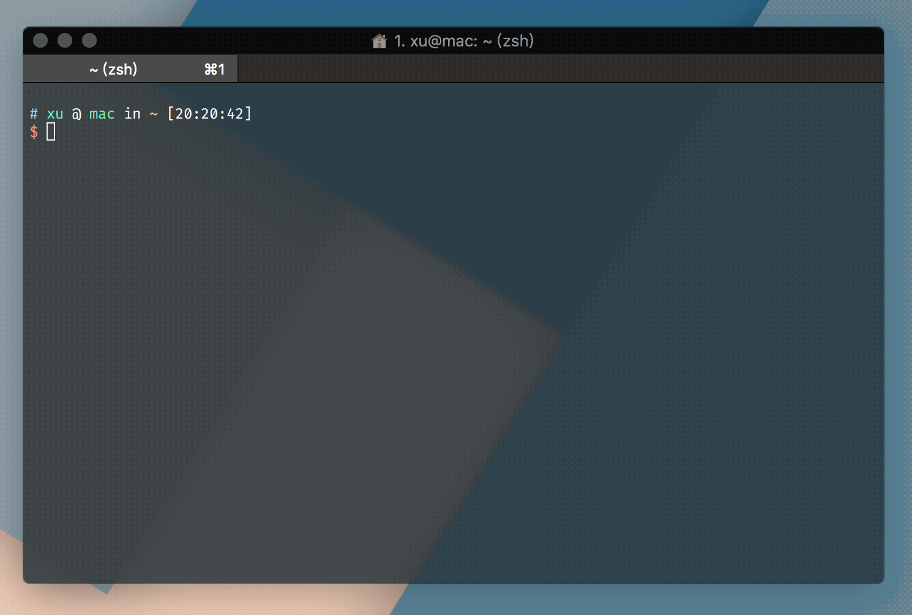

# charles-helper

print some helpful help for charles



## Usage

Firstly, install the package using [Yarn](https://yarnpkg.com/en/) (you'll need at least [Node.js LTS](https://nodejs.org/en/)):

```bash
yarn global add charles-helper
```

Or using npm:
```bash
npm i -g charles-helper
```

Once that's done, you can run this command to get helper:

```bash
charles-helper
```

Now you understand how the package works! :tada:

## Author

ouxu([@ouxu](https://github.com/ouxu))
